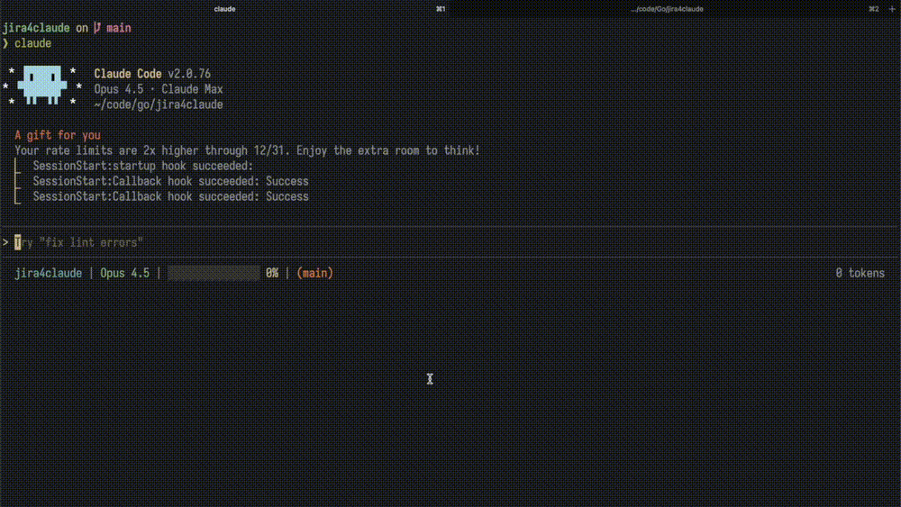

# jira4claude

A minimal Jira CLI designed for AI coding agents.



## Why?

AI agents need CLI tools that:
- Never prompt for input or hang waiting for user interaction
- Produce predictable, parseable output
- Have explicit flags instead of interactive menus

This CLI is built specifically for that use case.

## Design Principles

- **Agent-first** - never prompt, never hang, always explicit
- **Minimal scope** - only the commands agents actually need
- **Clean output** - human-readable tables, optional JSON for parsing

## Setup

### 1. Credentials

Add your Jira credentials to `~/.netrc`:

```
machine yourcompany.atlassian.net
  login your-email@example.com
  password your-api-token
```

Get an API token from [Atlassian Account Settings](https://id.atlassian.com/manage-profile/security/api-tokens).

### 2. Configuration

Initialize a config file in your project:

```bash
j4c init --server=https://yourcompany.atlassian.net --project=PROJ
```

This creates `.jira4claude.yaml` with your server and default project.

## Status

Alpha. Built to solve a specific workflow problem.

## License

MIT
